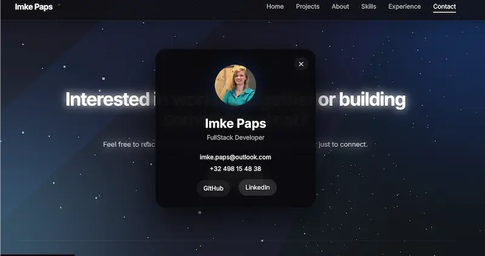

# Imke Paps — Portfolio

A modern fullstack developer portfolio built to showcase projects, technical skills and interactive frontend experiences through smooth animations, immersive visuals and scalable architecture.



---

## Live Demo

https://imkepaps.com 

---

## ✨ Features

- Responsive modern UI
- Interactive project detail pages
- Smooth animations with Framer Motion
- 3D visual background using React Three Fiber
- Dynamic particle and aurora effects
- Expandable mobile sections
- Interactive image gallery with fullscreen preview
- Video support for project showcases
- Clean and scalable component architecture
- Mobile-first responsive experience

---

## 🛠️ Built With

### Frontend

- React
- TypeScript
- Vite
- CSS Modules

### Animation & Visuals

- Framer Motion
- React Three Fiber
- Three.js

### Routing

- React Router DOM

---

## 📁 Project Structure

```bash
src/
 ├── components/
 ├── layouts/
 ├── pages/
 ├── data/
 ├── styles/
 └── assets/
```

 ---
## 🎯 Goals Of The Project

This portfolio was designed to:

* Showcase fullstack development skills
* Experiment with immersive UI and motion
* Create a premium and modern user experience
* Practice scalable frontend architecture
* Combine performance with visual polish

---

## 📸 Media Support

Projects support:

* Image galleries
* Fullscreen image previews
* Embedded showcase videos
* GitHub & live website links

---

## 📱 Responsive Design

The application is fully optimized for:

* Desktop
* Tablet
* Mobile devices

With adaptive layouts, interactive navigation and optimized spacing across breakpoints.

---

## 👤 Author

Imke Paps

Fullstack developer focused on building scalable applications, polished interfaces and modern digital experiences.

* GitHub: https://github.com/imkePaps
* LinkedIn: https://www.linkedin.com/in/imke-p-b93241200/

---

## 📄 License

This project and its source code are personal portfolio work created by Imke Paps.

The project is publicly visible for showcase and educational purposes only.
